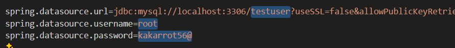

Vào mysql, tạo một database (chỉ cần tạo là đủ)
Vào \demo\src\main\resources\application.properties (project) sửa các phần như hình (tên database, username và password mysql):

Khởi chạy backend: vào thư mục demo, chạy lệnh: ./mvnw.cmd spring-boot:run
Khởi chạy frontend: vào thư mục fe, chạy lệnh: npm install, sau đó npm run dev

Chạy các lệnh insert (data mẫu) bằng mysql (trong file sql.txt)

Truy cập trang login: http://localhost:3000/

Vì chưa có trang đăng kí (front end), nên tạm thời đăng kí bằng cách gửi post request đến backend bằng postman
